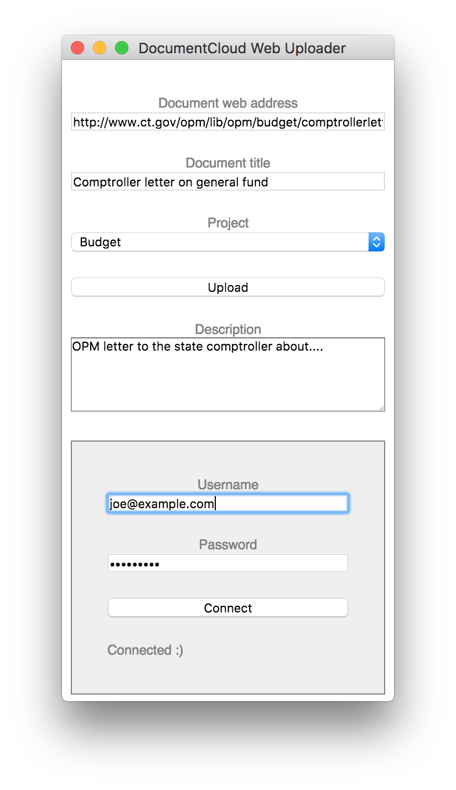

### Upload to DocumentCloud from web instead of local file

DocumentCloud is an amazing resource, but the web interface doesn't allow
directly uploading from a public web address, even though the API does.

This is just a very quick Electron/Vanilla JS app with zero emphasis on
design, just to give me a handy feature not available in the browser.

I just based it on the quick start guide in the Electron docs:
https://electronjs.org/docs/tutorial/first-app 

If anyone wants to take this and run with it, please do!

### Usage

Run this with npm start.

Put in your username and password, then hit connect.

If everything works, the "projects" dropdown will be populated with your
DocumentCloud projects.

Enter a public web URL, a title, and a description. Choose a project to put
it in, or none.

Hit upload.

If everything works, it will show you the DocumentCloud URL.